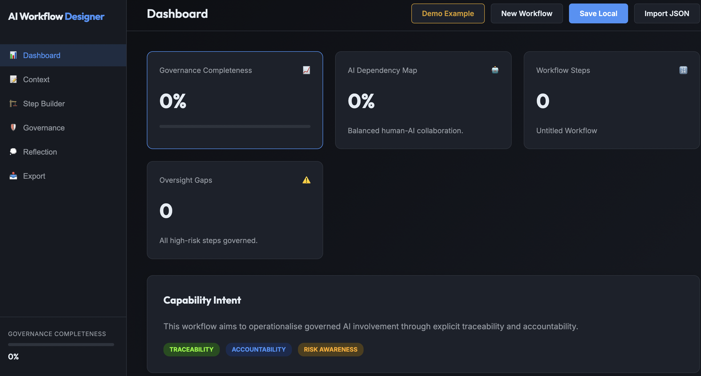

# AI Workflow Governance Designer

A governance-first design environment for creating, analysing, and documenting AI-supported workflows with explicit human oversight and accountability.

## 🚀 Overview
The **AI Workflow Governance Designer** enables users to design structured workflows, define human–AI boundaries, and embed governance and risk controls directly into the system design. It is built on Capability-Driven Development (CDD) principles to ensure traceability and professional-grade governance.

## 🚀 How to Use

1.  **Define Context**: Start in the **Context** tab to define the workflow's title, purpose, and ownership. This sets the foundational scope for accountability.
2.  **Build Steps**: Use the **Step Builder** to add, edit, and reorder workflow steps. For each step, explicitly define the **Human-AI Boundary** (Responsible Role and Oversight Level).
3.  **Identify Risks**: Within each step, assess potential **Bias, Operational, and Ethical risks**, and define mitigation strategies.
4.  **Governance Controls**: For each step, set escalation paths and review cycles. For **Decision Points**, you can mandate a Decision Record.
5.  **Reflect**: Use the **Reflection Layer** to document failure modes, essential human judgement, and systemic assumptions.
6.  **Monitor Progress**: Check the **Dashboard** for real-time metrics, including the **Governance Completeness Index** and **AI Dependency Map**.
7.  **Export**: Once complete, use the **Export** tab to generate professional **JSON, Markdown, or PDF** artifacts.

## 🧩 Core Features
- **Governance-First Design**: Focus on accountability and traceability.
- **Human-AI Boundary Definition**: Explicitly define where AI ends and Human begins.
- **Oversight Gaps Indicator**: Automatically flags high-risk AI steps lacking oversight.
- **Local-First & Privacy-Preserving**: All data stays in your browser's LocalStorage.
- **Governance-Ready Exports**: Generate professional documentation for audits.

## Live Application

Use the live tool here:

**http://cloudpedagogy-ai-workflow-governance-designer.s3-website.eu-west-2.amazonaws.com/**

## Screenshot



## 🏗️ Technical Stack
- Vanilla HTML/CSS/JS (TypeScript)
- Vite for build and development
- Local-first (LocalStorage) persistence

## 🛠️ Getting Started
### Development
```bash
npm install
npm run dev
```

### Build
```bash
npm run build
```
The build output will be in the `dist` directory, ready to be hosted on S3 or GitHub Pages.
